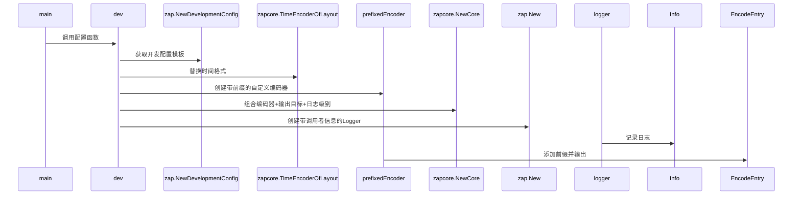

```go
package main

import (
	"go.uber.org/zap"
	"go.uber.org/zap/buffer"
	"go.uber.org/zap/zapcore"
	"os"
)

// 定义前缀
const logPrefix = "[MyApp] "

// 自定义 Encoder
type prefixedEncoder struct {
	zapcore.Encoder
}

func (e *prefixedEncoder) EncodeEntry(entry zapcore.Entry, fields []zapcore.Field) (*buffer.Buffer, error) {
	// 先调用原始的 EncodeEntry 方法生成日志行
	buf, err := e.Encoder.EncodeEntry(entry, fields)
	if err != nil {
		return nil, err
	}

	// 在日志行的最前面添加前缀
	logLine := buf.String()
	buf.Reset()
	buf.AppendString(logPrefix + logLine)

	return buf, nil
}
func dev() {
	// 使用 zap 的 NewDevelopmentConfig 快速配置
	cfg := zap.NewDevelopmentConfig()
	cfg.EncoderConfig.EncodeTime = zapcore.TimeEncoderOfLayout("2006-01-02 15:04:05") // 替换时间格式化方式
	// 创建自定义的 Encoder
	encoder := &prefixedEncoder{
		Encoder: zapcore.NewConsoleEncoder(cfg.EncoderConfig), // 使用 Console 编码器
	}
	// 创建 Core
	core := zapcore.NewCore(
		encoder,                    // 使用自定义的 Encoder
		zapcore.AddSync(os.Stdout), // 输出到控制台
		zapcore.DebugLevel,         // 设置日志级别
	)

	// 创建 Logger
	logger := zap.New(core, zap.AddCaller())

	logger.Info("dev this is info")
	logger.Warn("dev this is warn")
	logger.Error("dev this is error")
}

func main() {
	dev()
}

```

以下是对这段代码的详细解析，结合Zap日志库的自定义编码器机制与开发环境配置策略：

---

### 一、代码核心功能
这段代码实现了**Zap日志库的深度定制**，主要包含两个核心功能：
1. **全局日志前缀**：在所有日志行首添加固定标识`[MyApp]`
2. **结构化时间格式**：将默认时间格式改为`"2006-01-02 15:04:05"`  
   通过组合Zap的编码器接口实现非侵入式扩展，保持Zap的高性能特性。

---

### 二、关键代码解析
#### 1. 自定义编码器结构
```go
type prefixedEncoder struct {
    zapcore.Encoder // 嵌入原生编码器（实现接口继承）
}

func (e *prefixedEncoder) EncodeEntry(...) (*buffer.Buffer, error) {
    buf, _ := e.Encoder.EncodeEntry(...) // 调用原生方法生成日志
    logLine := buf.String()
    buf.Reset()
    buf.AppendString(logPrefix + logLine) // 添加前缀
    return buf, nil
}
```
- **设计模式**：采用组合模式扩展原生编码器，而非直接修改源码
- **性能优化**：直接操作`buffer.Buffer`避免内存复制，符合Zap零分配设计理念
- **输出效果**：原生日志行`INFO dev this is info` → `[MyApp] INFO dev this is info`

#### 2. 开发环境配置
```go
func dev() {
    cfg := zap.NewDevelopmentConfig()
    cfg.EncoderConfig.EncodeTime = zapcore.TimeEncoderOfLayout("2006-01-02 15:04:05")
    encoder := &prefixedEncoder{
        Encoder: zapcore.NewConsoleEncoder(cfg.EncoderConfig),
    }
    core := zapcore.NewCore(encoder, os.Stdout, zapcore.DebugLevel)
    logger := zap.New(core, zap.AddCaller())
}
```
- **配置策略**：
    - 使用`NewDevelopmentConfig()`获取开发环境预设（含调用者信息）
    - `NewConsoleEncoder`生成易读的控制台格式（非JSON）
    - `AddCaller()`自动添加文件名和行号（开发调试关键信息）

---

### 三、技术实现原理
| 组件             | 作用                                                                 | 关联文档         |
|------------------|--------------------------------------------------------------------|-----------------|
| **zapcore.Core** | 连接编码器、输出目标、日志级别的核心枢纽                              | [Zap官方文档] |
| **buffer.Buffer**| Zap专用的高性能缓冲池，避免GC压力                                   | [Zap优化原理] |
| **AtomicLevel**  | 动态调整日志级别（本例未展示但支持扩展）                             | [生产配置示例] |

---

### 四、执行流程分析


---

### 五、优化建议
1. **错误处理增强**
```go
core := zapcore.NewCore(...)
if core == nil {
    panic("Core初始化失败") 
} // 参照生产级配置校验
```

2. **多输出源扩展**
```go
// 同时输出到文件和控制台（参考lumberjack库）
fileSyncer := zapcore.AddSync(&lumberjack.Logger{Filename: "app.log"})
output := zapcore.NewMultiWriteSyncer(os.Stdout, fileSyncer)
core := zapcore.NewCore(encoder, output, zapcore.DebugLevel)
```

3. **颜色标记集成**
```go
// 在EncodeEntry中插入ANSI颜色码（需判断终端支持）
if terminal.IsTerminal() {
    logLine = colorBlue + logLine + colorReset
}
```

---

### 六、应用场景
- **微服务标识**：在多服务系统中通过前缀快速过滤日志
- **安全审计**：为敏感操作日志添加统一标记
- **版本追踪**：在日志前缀中嵌入构建版本号（结合CI/CD）

---

通过这种定制化方案，开发者既能保持Zap的高性能优势，又能满足特定的日志格式要求。如需更复杂的定制（如动态前缀、条件染色），可进一步实现`zapcore.Encoder`的全部接口方法。


